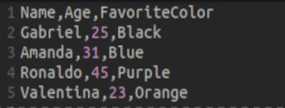
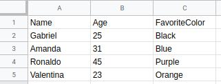
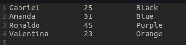

# Tratando um arquivo CSV

## Introdução
Arquivos com extenção "**CSV**" são arquivos de texto simples que armazenam informações de planilhas e tabelas.

Aqui temos um exemplo de um arquivo **CSV**:




Perceba que os campos são separados por um caracter. <br>
Geralmente esse caractere é uma vírgula ou ponto e vírgula ->  **","**  ou  **";"**  .
<br>

Aqui vemos esse mesmo arquivo em uma planlha:




Quando estamos trabalhando com um arquivo com poucas linhas, fica fácil manusear. Mas e se tivéssemos um arquivo com 10.000 linhas?
Seria muito mais difícil tratar esse arquivo.


Com esse programa, o usuario conseguirá tratar um arquivo **CSV**, deixando a leitura do documento mais amigável. <br>
De que forma? <br>
Removendo todos os caracteres de separação de campo e dando um espaçamento entre eles.
<br>


Documento não tratado: <br>
;


Documento tratado: <br> 


Quando estamos trabalhando com um arquivo com poucas linhas, fica fácil manusear. Mas e se tivéssemos um arquivo com 10.000 linhas?
Seria muito mais difícil tratar esse arquivo.
<hr>

## Requisitos para executar o programa
* Ter o **[JDK](https://docs.oracle.com/en/java/javase/11/install/installation-jdk-linux-platforms.html#GUID-737A84E4-2EFF-4D38-8E60-3E29D1B884B8)** instalado
<hr>

## Passo a passo para executar o programa

1. Acesse o diretório que voce deseja armazenar o programa. 

2. Abra o terminal e digite o seguinte commando:

```console
    
    git clone https://github.com/lGabrielDev/Java_tratar_arquivo_csv.git;

``` 
Com esse comando, será feito o download dos arquivos necessários funcionar o programa.


3. Acesse o diretório do programa utilizando o command:

```console

    cd Java_tratar_arquivo_csv/;

```

4. Abra o programa utilizando o command:

```console

    javac Programa.java;
    java Programa;

```

Pronto. Programa iniciado.

<br>

5. Digite o caminho do arquivo que deseja tratar.
6. Digite o separador dos campos. Geralmente o separador é uma **vírgula** ("**,**") ou um **ponto e vírgula** ("**;**") .


<br>

Se tiver alguma dúvida e quiser consultar o código completo do programa, clique [<span style="color:red">**aqui**</span>.](https://github.com/lGabrielDev/Java_tratar_arquivo_csv/blob/main/Programa.java)