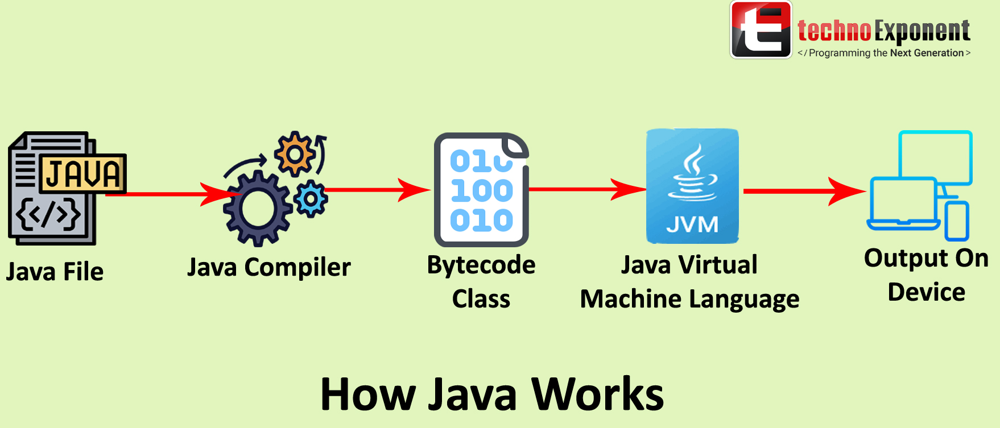

<!-- title -->
<h1 align="center">
    Relembrando alguns conceitos
</h1>

## Como o computador entende nosso código? <br> `.java` and `.class`



<br>

O fluxo funciona assim:

1. Escrevemos um código em Java (linguagem que nós humanos entendemos). Isso gera um arquivo com a extensão `.java`.

<br>

2. Utilizando o command `javac`, conseguimos compilar/transformar o arquivo `.java` (linguagem humana) para um arquivo `.class` (arquivo binário).

<br>

3. Utilizando o command `java`, a JVM consegue ler o código binário e executá-lo no Sistema Operacional.

<br>

📖 A JVM é uma máquina virtual que interpreta e executa o arquivo bytecode `.class` em diferentes sistemas operacionais. Assim, não precisamos compilar um arquivo bytecode para cada sistema operacional. Basta que esses sistemas diferentes possuam o JVM instalado.

<br>

### Praticando

1. Criamos o arquivo com extensão `.java`:
    ```java
    public class AppInsano{
        public static void main(String[] args){
            System.out.println("Salve gurizada!");
        }
    }
    ```

<br>

2. Compilamos o arquivo `.java`, utilizando o command `javac`:
    ```bash
    javac AppInsano.java; #java compile/compilar
    ```
    📖 Quando estamos falando em "compilar" um arquivo java, estamos transformando um arquivo `.java` em um arquivo `.class`. Ou seja, estamos traduzindo um arquivo `.java` em um arquivo em bytecode(0,1). Assim, o computador consegue entender o código que você escreveu.

<br>

3. Rodamos esse arquivo **.class** com o command `java`

    Agora que o arquivo tem extensão `.class` (arquivo executável), conseguimos executar o arquivo.

    ```bash
    java AppInsano;
    ```

<hr>
<br>

## Arquivo .jar
**Java ARchive**

É um arquivo compactado que contêm vários arquivos `.class` necessários para funcionar uma aplicação.

Para rodar um arquivo .jar, usamos o command `java -jar`.

<hr>
<br>


## Relembrando

- `.java`  --> human readable code (código que nós 'humanos' entendemos).
- `.class` --> arquivo bytecode/binário compreensível pelo computador.
- `.jar`   --> arquivo executável que reúne todas as `.class` de um projeto